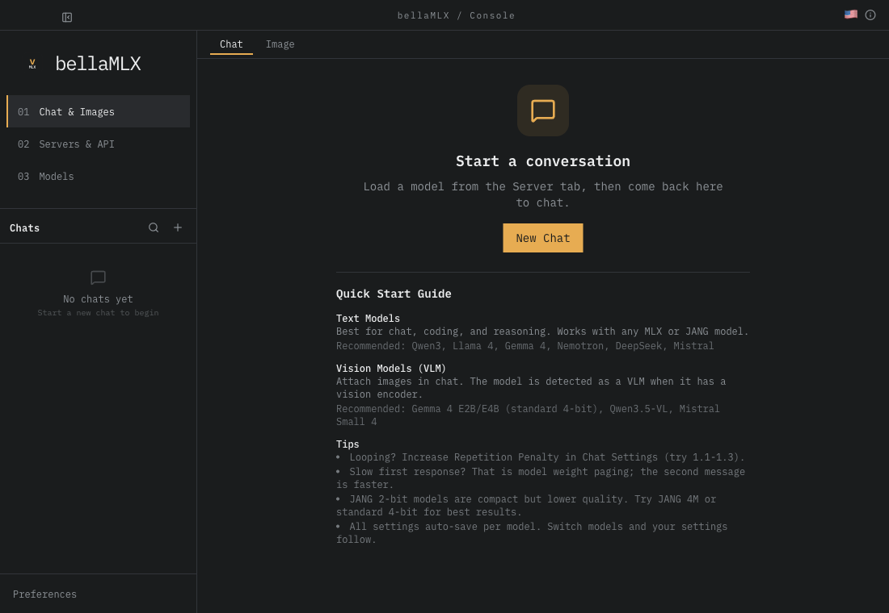
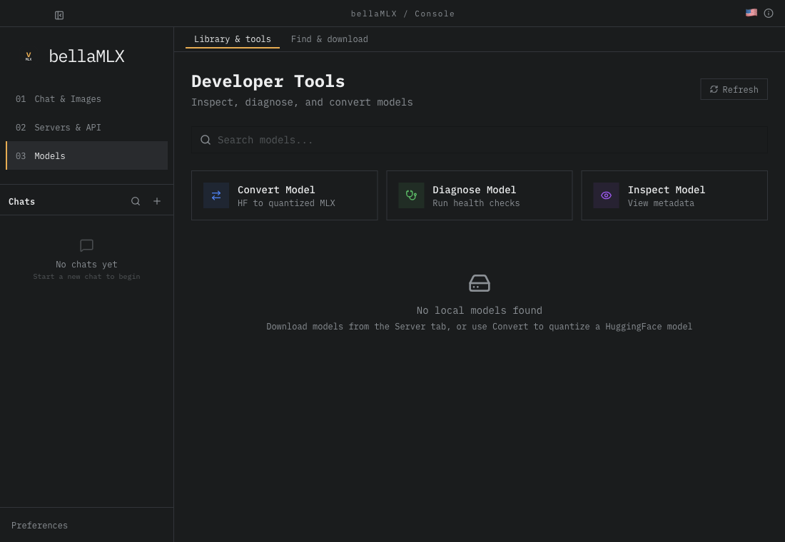

<h1 align="center">bellaMLX</h1>

<p align="center">
  <strong>A desktop home for local MLX inference on Apple Silicon.</strong>
</p>

<p align="center">
  Load models, chat locally, and manage your settings in a macOS desktop app. bellaMLX is a fork of vMLX, with an initial focus on reliable model loading, chat, settings, and persistence.
</p>

<p align="center">
  <a href="#development">Get started</a> ·
  <a href="docs/DEVELOPMENT.md">Development guide</a> ·
  <a href="docs/CORRECTNESS.md">Correctness status</a> ·
  <a href="LICENSE">License</a>
</p>

<p align="center">
  <a href="panel/tests/electron/screens.spec.ts-snapshots/chat-empty-darwin.png">
    
  </a>
</p>

<p align="center">
  <em>The bellaMLX chat workspace. Select the image to view it at full size.</em>
</p>

## Project focus

- **Model loading:** start and stop local model sessions, with clear loading and recovery states.
- **Chat:** stream responses, cancel generation, switch conversations, and return to saved history.
- **Settings and persistence:** retain preferences and keep conversation settings tied to the selected model.

This fork is in development. The existing screen structure remains in place; new inference capabilities and public distribution are deferred. See the [correctness baseline](docs/CORRECTNESS.md) for verified workflows and remaining work.

<details>
<summary>More of the interface: model library and tools</summary>

[](panel/tests/electron/screens.spec.ts-snapshots/models-darwin.png)

These screenshots come from the reviewed UI test baselines. They show the interface with no models loaded; they do not establish compatibility with every model or validate every inherited tool.

</details>

## Development

Use **macOS on Apple Silicon, Node 22, and Python 3.12**, with `uv` installed.

From the repository root:

```sh
uv venv --python 3.12
uv pip install --python .venv/bin/python -e .
cd panel
npm ci
npm run dev
```

The Python CLI remains `vmlx-engine` and the Python import remains `vmlx_engine`. Model downloads are not required for deterministic UI tests.

For test commands, isolated live-model checks, and screenshot review, see the [development and testing guide](docs/DEVELOPMENT.md).

## App data

The desktop application is named **bellaMLX**, with application ID `app.bellamlx.desktop`. Its default macOS application data is stored at:

```text
~/Library/Application Support/bellaMLX
```

There is no automatic migration from upstream profiles. Upstream app-update checks are disabled. See [profiles and diagnosis](docs/DEVELOPMENT.md#profiles-and-diagnosis) for development overrides.

## Attribution

This fork retains the upstream [license](LICENSE), Git history, and third-party license files. [Inherited notices](THIRD_PARTY_NOTICES.txt) preserve attribution-bearing upstream documentation. Original authorship metadata does not imply an upstream endorsement of bellaMLX.
